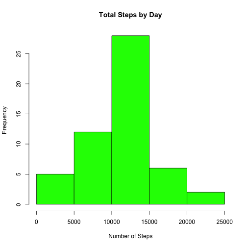
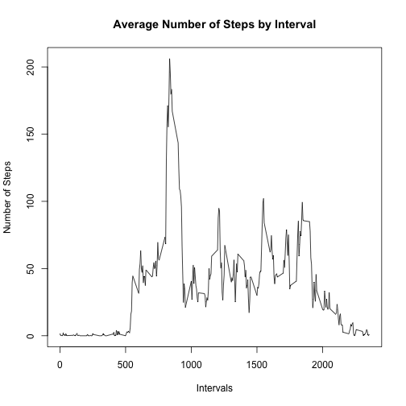
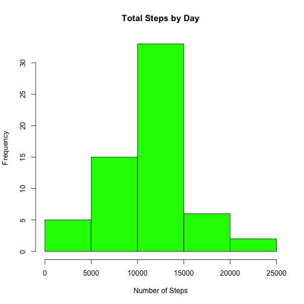
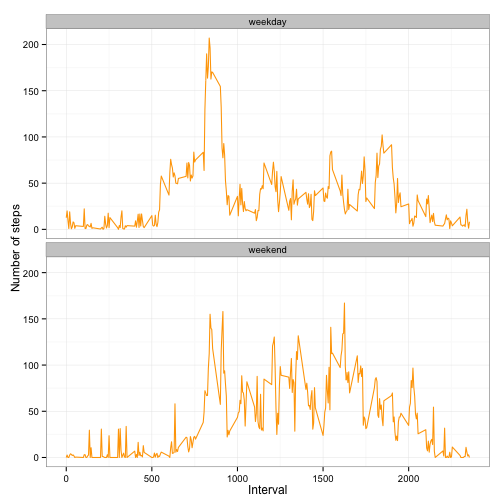

## Loading Libraries

NOTES:  Download the data file activity.csv in your working directory.
        Install the following packages in your R enviroment:
        knitr, data.table, dplyr, ggplot2, Hmisc, timeDate
        

```r
library(knitr)
library(data.table)
library(dplyr)
library(ggplot2)
library(Hmisc)
library(timeDate)
opts_chunk$set(echo=TRUE, results='hold')
```


## Loading and preprocessing data


```r
# In your working directory
activity = read.csv("activity.csv")
```

## What is mean total number of steps taken per day?

In this part we are going to ignore the missing values and calculate the steps per day.


```r
# Aggregate by date and sum

stepsbydate <- aggregate(steps ~ date, activity, sum)
head(stepsbydate)
```

```
##         date steps
## 1 2012-10-02   126
## 2 2012-10-03 11352
## 3 2012-10-04 12116
## 4 2012-10-05 13294
## 5 2012-10-06 15420
## 6 2012-10-07 11015
```

Now we are going to make an histogram of the steps taken by date


```r
#  histogram of the total number of steps taken each day
hist(stepsbydate$steps, col="green", main = paste("Total Steps by Day"), xlab = "Number of Steps")
```

 

Now we are going to calculate de mean and median of the steps taken per date


```r
smean <- mean(stepsbydate$steps)
smedian <- median(stepsbydate$steps)
```
The mean is 1.0766189 &times; 10<sup>4</sup> and the median is 10765.

## What is the average daily activity pattern?

We are going to calculate the mean of the steps for each interval


```r
# Aggregate by interval and sum

stepsbyinterval <- aggregate(steps ~ interval, activity, mean)
```

With this information we are going to draw a histogram of the average steps for each interval


```r
#  histogram of the total number of steps taken each day
plot(stepsbyinterval$interval, stepsbyinterval$steps, type="l", xlab="Intervals", ylab="Number of Steps", main="Average Number of Steps by Interval")
```

 

Which 5-minute interval, on average across all the days in the dataset, contains the maximum number of steps?


```r
interval <- stepsbyinterval[which.max(stepsbyinterval$steps),1]
```

The interval that contains the maximun number of steps is 835.


## Imputing missing values

### 1. Calculate and report the total number of missing values in the dataset (i.e. the total number of rows with NAs)


```r
numna <- sum(is.na(activity$steps))
```

The number of missing values are 2304

### 2. We are asked to devise a strategy for filling in all of the missing values in the dataset

To achive this we are going to impute the missing values with a random number between the steps values that exist
in the data. In the same step we create a new dataset with the missing values filled in.


```r
newactivity <- data.frame(activity)
newactivity$steps <- with(newactivity, impute(steps, 'random'))
str(newactivity)
```

```
## 'data.frame':	17568 obs. of  3 variables:
##  $ steps   :Class 'impute'  atomic [1:17568] 0 18 0 0 0 63 0 57 42 0 ...
##   .. ..- attr(*, "imputed")= int [1:2304] 1 2 3 4 5 6 7 8 9 10 ...
##  $ date    : Factor w/ 61 levels "2012-10-01","2012-10-02",..: 1 1 1 1 1 1 1 1 1 1 ...
##  $ interval: int  0 5 10 15 20 25 30 35 40 45 ...
```

### 3. Now we are asked to make a histogram of the total number of steps taken each day and Calculate and report the mean and median total number of steps taken per day.

We are going to do the same as previous step but with the new dataset.


```r
# Aggregate by date and sum

newstepsbydate <- aggregate(steps ~ date, newactivity, sum)
head(newstepsbydate)
```

```
##         date steps
## 1 2012-10-01  9750
## 2 2012-10-02   126
## 3 2012-10-03 11352
## 4 2012-10-04 12116
## 5 2012-10-05 13294
## 6 2012-10-06 15420
```


```r
#  histogram of the total number of steps taken each day
hist(newstepsbydate$steps, col="green", main = paste("Total Steps by Day"), xlab = "Number of Steps")
```

 


```r
newsmean <- mean(newstepsbydate$steps)
newsmedian <- median(newstepsbydate$steps)
```

### Do these values differ from the estimates from the first part of the assignment?

The old mean was 1.0766189 &times; 10<sup>4</sup> and the old median was 10765.
The new mean is 1.0744049 &times; 10<sup>4</sup> and the new median is 10765.

As we can see there is a difference between the first part of the assigment

### What is the impact of imputing missing data on the estimates of the total daily number of steps?
Applying a random filled in of the missing values creates a similar histogram pattern with a slight decreasing in the mean and median. Imputing the missing values does not affect the dataset.

## Are there differences in activity patterns between weekdays and weekends?

Create a new factor variable in the dataset with two levels - "weekday" and "weekend" indicating whether a given date is a weekday or weekend day.

First we are going to use TimeDate package where there is a function call isWeekday that output a logical result if the date is weekday or weekend.


```r
#Create new logical column
newactivity$wdwe <- with(newactivity, isWeekday(newactivity$date))
#convert to character
newactivity$wdwe <- as.character(newactivity$wdwe)
#Replace with weekday or weekend
newactivity$wdwe[newactivity$wdwe == "TRUE" ] <- "weekday"
newactivity$wdwe[newactivity$wdwe == "FALSE" ] <- "weekend"
#Converto to factor
newactivity$wdwe <- as.factor(newactivity$wdwe)
str(newactivity)
```

```
## 'data.frame':	17568 obs. of  4 variables:
##  $ steps   :Class 'impute'  atomic [1:17568] 0 18 0 0 0 63 0 57 42 0 ...
##   .. ..- attr(*, "imputed")= int [1:2304] 1 2 3 4 5 6 7 8 9 10 ...
##  $ date    : Factor w/ 61 levels "2012-10-01","2012-10-02",..: 1 1 1 1 1 1 1 1 1 1 ...
##  $ interval: int  0 5 10 15 20 25 30 35 40 45 ...
##  $ wdwe    : Factor w/ 2 levels "weekday","weekend": 1 1 1 1 1 1 1 1 1 1 ...
```

The new factor variable is call wdwe.

Now we are going to create a table with the average steps per day in weekdays and weekends


```r
tmpwd <- newactivity[(newactivity$wdwe == "weekday"),]
tmpwe <- newactivity[(newactivity$wdwe == "weekend"),]
avgwd <- aggregate(steps ~ interval, tmpwd, mean)
avgwe <- aggregate(steps ~ interval, tmpwe, mean)
avgwd$wdwe <- "weekday"
avgwe$wdwe <- "weekend"
avgwdwe <- rbind(avgwd, avgwe)
```

The following graphics compare the average number of steps taken per 5-minute interval across weekdays and weekends:


```r
g <- ggplot(avgwdwe,  aes(x=interval, y=steps))
g + geom_line(color = "orange") + facet_wrap(~ wdwe, nrow=2, ncol=1) + labs(x="Interval", y="Number of steps") + theme_bw()
```

 

We can see a different pattern between weekdays and weekend due to a more free time in weekend to make excercises or activities related to walk insted of the weekdays that we mostly stay in the office.


**J.Navarrete**
